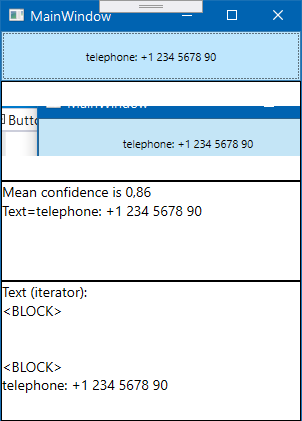

Samples that demonstrate using Tesseract library

## Tesseract .Net wrapper

v4.1.0.0 beta recompiled to avoid crashed on remote virtual machines

### Example

### Keywords
telephone, ocr, recognizer, tesseract, .net, c#, sample, phone 

## Original Source code and its license

[Tesseract.WebDemo](https://github.com/charlesw/tesseract-samples/tree/master/src/Tesseract.WebDemo)

Copyright 2012-2015 Charles Weld.

Licensed under the [Apache License, Version 2.0][apache2] (the "License"); you
may not use this software except in compliance with the License. You may obtain
a copy of the License at:

[apache2](http://www.apache.org/licenses/LICENSE-2.0)

Unless required by applicable law or agreed to in writing, software distributed
under the License is distributed on an "AS IS" BASIS, WITHOUT WARRANTIES OR
CONDITIONS OF ANY KIND, either express or implied. See the License for the
specific language governing permissions and limitations under the License.
